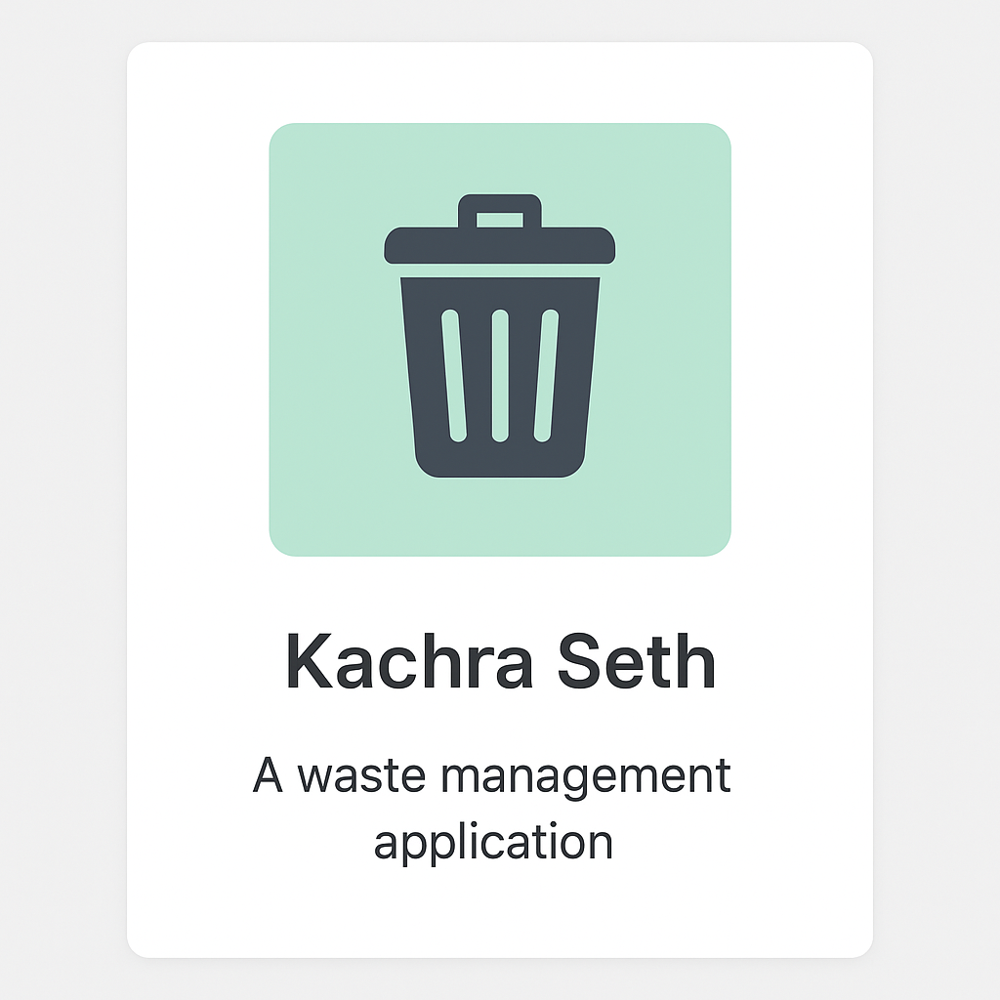

# 🌟 Babloo Kumar – Portfolio Website  

A modern, responsive portfolio website showcasing the **skills, projects, and achievements** of **Babloo Kumar**, a **B.Tech Information Technology student** at **Kalasalingam Academy of Research and Education**.  

---

## 📂 Project Structure  

Portfolio/
├── index.html # Main HTML file
├── styles.css # CSS styles and responsive design
├── script.js # JavaScript for interactivity
├── kachra.png # Project: Kachra Seth
├── voice.png # Project: Voice Assistant
├── library.png # Project: Library Management System
├── pandit.png # Project: Panditjee Booking
├── resturant.png # Project: Restaurant Bill System
└── README.md # Documentation file

---

## 📌 About Me  
Hi, I’m **Babloo Kumar**, a dedicated **Android & Web Developer** passionate about **AI/ML, App Development, and solving real-world problems**.  

- 🎓 Pursuing **B.Tech in Information Technology (2022–2026)** at KARE, Madurai  
- 💻 Skilled in **Kotlin, Java, Python, Firebase, MySQL, Web Development**  
- 🚀 Passionate about **building scalable, user-focused applications**  
- 🏆 Achievements include **Hackathon wins** and **International Paper Presentation**  

---

## 🌟 Portfolio Features  

- 🌙 Dark/Light Mode Toggle  
- ⚡ Animated Loading Screen  
- 📊 Scroll Progress Bar  
- 🔝 Back to Top Button  
- 🎨 Interactive Skills & Projects Showcase  
- 📧 Functional Contact Form with validation  
- 📱 Fully Responsive Design for all devices  

---

## 📂 Projects  

### ♻️ Kachra Seth  
An **Android app for scrap pickup** with Firebase backend, cloud sync, and blockchain for transaction trust.  
  

### 🎙️ Voice Assistant  
A **Python-based intelligent assistant** with speech recognition and APIs for commands like stock updates, calculations, and system automation.  
  

### 📚 Library Management System  
A **web-based library system** built with HTML, CSS, JS, and Firebase for book records, availability, and secure transactions.  
  

### 🙏 Panditjee Booking  
An **online booking system for rituals and Pandits**, featuring scheduling, payment, and reminders.  
  

### 🧾 Restaurant Bill System  
A desktop app for **generating and managing restaurant bills** efficiently.  
  

---

## 🛠️ Technical Skills  

- **Languages**: Kotlin, Java, Python, C  
- **Web Development**: HTML, CSS, JavaScript, Bootstrap  
- **Android Development**: Android Studio, Firebase, MySQL  
- **AI/ML Tools**: Python, API Integration  
- **Tools**: Git, GitHub, VS Code  

---

## 🏆 Achievements  

- 🥇 **Build-A-Bot Hackathon (1st Place, 2024)** – Built a financial chatbot with Flask & real-time APIs  
- 🥉 **ML Hackathon (3rd Place, 2023)** – Developed clustering-based ML model with advanced feature optimization  
- 📄 **Paper Presentation (ICISS 2025)** – Presented *Domain Analyst: All-In-One Tool for Domain Information and Security Analysis*  

---

## 📜 Certifications  

- 📱 **Android Development with Kotlin (Udemy, 2025)**  
- 🎓 **Paper Presentation at ICISS 2025**  

---

## 📞 Contact Me  

- 📧 **Email**: [bablookumarmfp86@gmail.com](mailto:bablookumarmfp86@gmail.com)  
- 🌐 **GitHub**: [github.com/bablookumarmuz](https://github.com/bablookumarmuz)  
- 🔗 **LinkedIn**: [linkedin.com/in/babloo-kumar-76ba60253](https://www.linkedin.com/in/babloo-kumar-76ba60253/)  
- 📱 **Phone**: +91 8229099477  
- 📍 **Location**: Madurai, Tamil Nadu, India  

---

## ⭐ Contribution  

This is my personal portfolio website.  
If you find any bugs or want to suggest improvements, feel free to open an issue or connect with me.  

---

### 👨‍💻 Developed with ❤️ by **Babloo Kumar**
